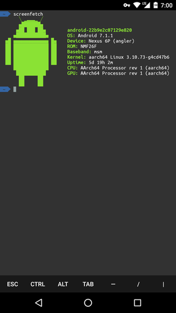

# termux-octo.th
读入 [`Chinese`](https://github.com/testingBOT9/termux-octo.th/blob/main/README(1).md)

A fork from [oh-my-termux](https://github.com/4679/oh-my-termux). Make your Termux colorful~

Add [oh-my-zsh](https://github.com/robbyrussell/oh-my-zsh) terminal
environment and [zsh-syntax-highlighting](https://github.com/zsh-users/zsh-syntax-highlighting) to Termux, set color style (mostly from [Gogh](https://github.com/Mayccoll/Gogh) and Powerline font ([from powerline/fonts](https://github.com/powerline/fonts)). The oh-my-zsh theme defaults to agnoster, the color style defaults to Tango, and the font defaults to Ubuntu.

**This Repo uses the official source of Termux. In Mainland China, you may need to add the Termux application to the proxy list.**
## Use:
```shell
~ sh -c "$(curl -fsSL https://github.com/Cabbagec/termux-ohmyzsh/raw/master/install.sh)"
```

## Set Colors:
Run `chcolor` to change the color style, or
```shell
~ ./.termux/colors.sh
```

## Set font 
Run `chfont` to change the font, or:
```shell
~ ./.termux.fonts.sh
```

## Need software package: 
-curl

## Restoring to the environment before installation
1. In the home directory, you can find the zshrc backup file named by date, like `.zshrc.bak.2018.1.1-00: 00: 00`, restore the file name to ` .zshrc`. If there is a backup file in aing, delete the current `.zshrc`.
2. In the home directory, you can find the termux backup configuration directory named by date, which is in the form of `.termux.bak.2018.1.1-00: 00: 00`, and restore its file name to `.termux`. If there is a backup, delete the current `.termux` directory.
3. Restart termux

## Use tips (refer to Termux Wiki) 
To adjust the font size, just pinch to zoom. 
In addition, Termux uses the volume keys to simulate some shell functions: 
* `Volume reduction+C`: That is, `Ctrl+C`, SIGINT interrupts the current shell process 
* `Volume Decrease+D`: That is, `Ctrl+D`, EOF to log out of the current shell 
* `Volume reduction+E`: namely `Ctrl+E`, move the shell cursor to the end of the line 
* `Volume reduction +L`: namely `Ctrl+L`, clear the screen content 
* `Volume reduction + Z`: that is `Ctrl+Z`, SIGTSTP suspends the current process in the shell

For some other keys, you can use `volume plus +Q` to call up the shortcut keypad, or use the following combinations: 
* `Volume plus +W`, `Volume plus +A`, `Volume plus +S`, `Volume plus +D`: move the cursor up, down, left, and right 
* `Volume plus +E`: ESC 
* `Volume plus +T`: TAB 
* `Volume plus + number`: F1-F9, F10 uses the number 0 
* `Volume plus +L`: pipe symbol "|" 
* `Volume plus +H`: tilde "~" 
* `Volume plus +U`: underscore "_" 
* `Volume plus +V`: control volume

For better typing support, just swipe left on the small keyboard of `volume plus +Q`

## Example 
Tango color theme + oh-my-zsh agnoster theme + Ubuntu font:

<details>


- - -
